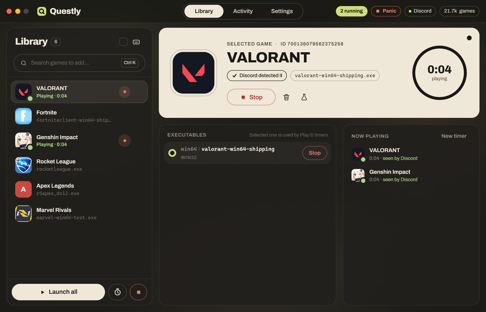

<h1 align="center">Questly</h1>

<p align="center"><strong>Discord quests, done quietly.</strong><br />
Questly makes Discord see a game running, so your quest timer ticks while you do anything else.</p>

<p align="center">
  <a href="https://github.com/svyixiu/questly/releases/latest/download/Questly.exe">Download for Windows</a> ·
  <a href="https://questly-plum.vercel.app/try">Try it in your browser</a> ·
  <a href="https://questly-plum.vercel.app">Website</a>
</p>



> [!WARNING]
> Making Discord believe you're playing a game you aren't goes against Discord's Terms of Service. Discord can take quest
> rewards back, warn you, or suspend or ban your account. Questly isn't affiliated with Discord, and nobody behind Questly is
> responsible for what happens to your account. Read the [Terms of Use](https://questly-plum.vercel.app/terms-of-use) before using it.

## How it works

Discord knows you're playing a game by spotting its program running on your PC. When you press Play, Questly starts a tiny
stand-in program with the same file name as the real game, so Discord spots it the same way. Questly never asks for your
Discord login, never reads your token or saved sign-in, and doesn't change Discord's files. To know when Discord has
picked a game up, it reads one kind of line from Discord's own log file on your PC.

It works for quests that ask you to play a desktop game for a while. Quests that need streaming, a console or in-game
achievements aren't covered.

## Features

- **Spotlight search** (Ctrl+K) over Discord's list of 20,000+ detectable games, searched in the background so typing stays smooth
- **Play, check a few, or Launch all**, with keyboard shortcuts for everything (press `?` in the app)
- **Timed runs** that can wait until Discord detects each game before counting down; all at once, or one after another in a fixed or random order
- **Game windows**: a small square window per game you can drag anywhere, keep off-screen or hide; it never steals focus
- **Performance Guard** closes a few games for a while when your PC struggles during a timed run, then brings them back with their time left
- **Panic Abort** (button or Ctrl+Shift+X) stops every game, the timer and background sessions at once
- **Legitimate Buddy** plays games from your library while you're away, within the hours, days and limits you set, and stops when you're back
- **Launch on startup**, quietly in the tray
- **Themes**: six built-in themes, any accent color, or a fully custom theme; the app icon follows your accent
- **Your library is a file**: `%APPDATA%\Questly\library.json`, with import (merge or replace) and export
- **One exe** that installs, launches and uninstalls itself, per user, without admin rights

## Install

1. Download [Questly.exe](https://github.com/svyixiu/questly/releases/latest/download/Questly.exe) (Windows 10 or 11, 64-bit).
2. Open it. Windows SmartScreen may say "Windows protected your PC" because Questly isn't code-signed yet: click
   **More info → Run anyway**. You can check the file against the SHA-256 on the [release page](https://github.com/svyixiu/questly/releases/latest).
3. Click **Install**, then accept the notice.

It installs to `%LOCALAPPDATA%\Programs\Questly` and can be removed from Settings → Installation or Windows Settings → Apps.

## Build from source

You need [Node.js](https://nodejs.org) with [pnpm](https://pnpm.io), [Rust](https://rustup.rs), and the
[Visual Studio C++ build tools](https://visualstudio.microsoft.com/visual-cpp-build-tools/).

```bash
pnpm install
# the stand-in game program, which gets built into Questly.exe
cd src-win && cargo build --release && cd ..
copy src-win\target\release\src-win.exe src-tauri\resources\src-win.exe
# the app
pnpm tauri build --no-bundle
```

The result is `src-tauri/target/release/discord-quest-completer.exe` (ship it as `Questly.exe`).

## Repository layout

| Folder | What's in it |
| --- | --- |
| `src/` | The app's interface (Vue 3, TypeScript, Tailwind CSS) |
| `src-tauri/` | The app's backend (Rust, Tauri 2): processes, installer, Discord log watcher, tray, icons |
| `src-win/` | The stand-in game program for Windows (C++, no runtime) |
| `web/` | The website, including the live demo, which runs the real interface from `src/` on a simulated PC |
| `src-linux/`, `src-darwin/`, `src-template/` | Stand-in programs for other systems, from the original project |

To work on the website: `pnpm run web:dev` (then open http://localhost:5180), and `pnpm run web:build` to build it into `web/dist`.

## Credits

Questly is a fork of [Discord Quest Completer](https://github.com/markterence/discord-quest-completer) by
[Mark Terence Tiglao](https://github.com/markterence). The core idea, the original Tauri app, the stand-in programs and the
daily mirror of Discord's detectable game list come from there. Thank you!

Questly also builds on Tauri, Vue.js, VueUse, Fuse.js, Tailwind CSS, discord-sdk and the Archivo typeface. See
[Licenses](https://questly-plum.vercel.app/licenses) and [Credits](https://questly-plum.vercel.app/credits).

## License

[MIT](LICENSE), keeping the original project's copyright notice. Questly isn't affiliated with, endorsed by or sponsored by
Discord Inc. "Discord" is a trademark of Discord Inc.
